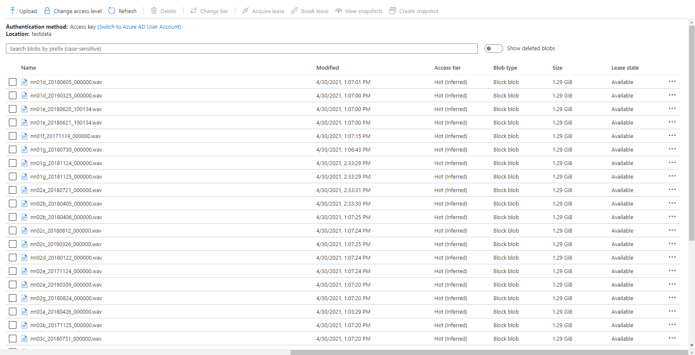

[__Back to home__](index.md)

# Design History

From concept to implementation and build...

## Overview

## Concept

The concept of our system was to train a machine learning model in order to classify sound. A sound classification model would be to detect whether or not there was a gunshot.

### Signal Processing

Trying to detect gunshots directly from sound waveform is hard because it does not give you much information to work with, only amplitude. Hence, we needed to do some signal processing to extract some features from the sound.

Initially we began research by reading papers and watching video lectures in signal processing. All sources of research we used can be found in ["Code and resources used"](coderesources.md).

What we found were two common signal processing techniques in order to analyse sound, the Mel-Frequency Cepstrum Coefficients (MFCCs, on the left below) and the Mel-Spectrogram (on the right below).

  
  

Since MFCCs were a smaller representation and most commonly used in audio machine learning for speech and sound classification, we believed it would be a great place to start, and build a dataset on. We also built a dataset with Mel-spectrograms.

### Machine Learning

#### Multi-layer perceptron (MLP)

The multi-layer peceptron is a common machine learning model used for things such as regression or classification, from our knowledge of machine learning we believed this network would not perform well due to its 'global approach' limitation, where all values are passed into the network at once. This will also have an extremely high complexity with the data representation of sounds we are using as we would have to flatten all the 3D arrrays into a single 1D array and input all of this data at once.

#### Convolutional Neural Network (CNN)

CNNs are mainly applied to analyse visual 2D data therefore we do not have to flatten our data like we have to do with MLP. Using this you can classify an image to find whether or not a gunshot is present since is "scans through" the data and looks for patterns, in our case a gunshot pattern. We could use both MFCC or Mel-spectrograms to train this.

#### Recurrent Neural Network (RNN)

A recurrent neural network is a special type of network which can recognise sequencing, and therefore we believed it would work very well in order the detect gunshots. This is because a gunshot typically has an initial impulse and then a trailing echo, an RNN would be able to learn this impulse and trailing echo type scenario and output whether it was a gunshot or something else. This would be trained with MFCCs.

#### Object Detection 

Although usually a larger architecture, object detection would work well in order to detect gunshots from Mel-Spectrograms due to a gunshots unique shape. This means that we can detect whether there is a gunshot present, but also how many gunshots are present as Object Detection won't classify the entire image like a CNN would, it would classify regions of the image.

## Implementation

### The Dataset

**The data we were given was a key factor and had a direct impact in which models worked for us and did not.**

We were given thousands of hours of audio data, each file being 24 hours long. Since we were provided with 'relative' gunshot locations in audio clips, our dataset was very noisy, the time locations we were given usually contained a gunshot within 12 seconds of the given time, and sometimes contained multiple gunshots. Due to the lack of time on this project, it was not realistic to listen to all of the sound clips and manually relabel all our data by ear, also, gunshots are sometimes very hard to distinguish from other rainforests sounds by ear, and many of these other sounds were very new to us. This is why we took a 12 second window in our signal processing, to ensure all of our data contains the gunshot(s). 

Luckily, in our testing of different machine learning techniques, we found an approach to solve the problem of detecting gunshots in noisy data, as well as building a clean dataset for the future!

### CNN with Mel-Spectrogram

Building a simple CNN with only a few convolutional layers, which a dense layer classifying whether there is a gunshot or not, worked quite well, with precision and recall above 80% on our validation sets! However, this method on noisy images did not work well, noisy images being a Mel-spectrogram with a lot of different sounds, such as below. Although it has an OK precision and recall, we cannot guarantee all the gunshots will be the only sounds occuring at once. Below you can see an example of a gunshot which can be detected using a CNN, and a gunshot that cannot be detected using a CNN.

  
  

### CNN and RNN with MFCC

This method suffered a similar problem with noise as the [CNN with Mel-Spectrogram](#CNN-with-Mel-Spectrogram) did. However with a clean dataset, we think an RNN with MFCC would work extremely well!

### Object Detection with Mel-Spectrogram

Object Detection won't classify the entire image like a CNN would, it would classify regions of the image, and therefore it can ignore other sound events on a Mel-spectrogram. In our testing we found that object detection worked very well in detecting gunshots on a mel-spectrogram, and could even be trained to detect other sound events such as raindrops hitting the acoustic recorder, monkey alarm calls and thunder!

What this allowed us to do was to also get the extact start and end times of gunshots, and hence automatically building a clean dataset that can be used to train networks in the future with much cleaner data that contains the exact location of these sound events! This method also allowed us to count the gunshots by seeing how many were detected in the 12s window, as you can see below.

## Build

### Use of cloud technology

In this project, the use of cloud technology allowed us to speed up many processes, such as building the dataset. We used Microsoft Azure to store our thousands of hours of sound files, and Azure Machine Learning studio to train some of our models, pre-process our data and build our dataset!

#### Storage

In order to store all of our sound files, we used blob storages on Azure. This meant that we could import these large 24 hour audio files into Azure ML studio for building our dataset. Azure ML studio allowed us to create IPYNB notebooks to run our scripts to find the gunshots in the files, extract them and build our dataset.

#### Data labelling

Azure ML studio also provided us with a Data Labelling service where we could label our Mel-spectrograms for gunshots and build our dataset to train our object detection models. These object detection models (Yolov4 and Faster-RCNN) use XML files in training, Azure ML studio allows us to export our labelled data in a  COCO format in a JSON file. The conversion from COCO to the XML format we needed to train our models was done with ease.

### Custom Vision

The Custom Vision model is the simplest model of the three to train. We did this by using [Azure Custom Vision](https://customvision.ai), it allowed us to upload images, label the images and train models with no code at all!

Custom Vision is a part of the Azure Cognitive Services provided by Microsoft which is used for training different machine learning models in order to perform image classification and object detection. This service provides us with an efficient method of labelling our sound events ("the objects") for training models that can detect gunshot sound events in a spectogram.

First, we have to upload a set of images which will represent our dataset and tag them by creating a bounding box around the sound event ("around the object"). Once the labelling is done, the dataset is used for training. The model will be trained in the cloud so no coding is needed in the training process. The only feature that we have to adjust when we train the model is the time spent on training. A longer time budget allowed means better learning. However, when the model cannot be improved anymore, the training will stop even if assigned a longer time.

  
  

The service provides us with some charts for the model's precision and recall. By adjusting the probability threshold and the overlap threshold of our model we can see how the precision and recall changes. This is helpful when trying to find the optimal probability threshold for detecting the gunshots.

The final model can be exported for many uses, in many formats. We use the Tensorflow model. The system contains two python files for object detection, a pb file that contains the model, a json file with metadata properties and some txt files. We adapted the system from the standard package provided. The sound files are preprocessed inside the predict.py file and it extracts the audio files from the sounds folder and it exports labelled pictures with the identified gunshots in cache/images folder. It then does inference on the spectrogram to detect gunshots. Once all the soundfiles have been checked a CSV is generated with the start and end times of the gunshots detected within the audio.

### Yolov4

#### Introduction

The full name of *YOLOV4* is *YOU ONLY LOOK ONCE*. It is an object detector which consists of a bunch of deep learning techniques and completely based on Convolutional Neural Network(CNN). The primary advantages of YOLOv4 compared to the other object detector are the fast speed and relatively high precision. 

The objective of Microsoft project 15 is detecting the gunshots in forest. The conventional audio classification method is not effective and efficient on this project, because the labelling of true locations of gunshots in training set is inaccurate. Therefore, we start to consider computer vision method, like YOLOV4, to do the detection. Firstly, the raw audio files are converted into thounds of 12 seconds clips and represented in Mel-spectrum. After that, according to the information of true locations of gunshots, the images that contain the gunshots are picked out and construct training data set. These pre-processing steps are the same with the other techniques used to do the detection for project 15 and you can find the detailed explanations from https://r15hil.github.io/ICL-Project15-ELP/.

In this project, YOLOV4 can be trained and deployed on NVIDIA GeForce GTX 1060 GPU and the training time is approximately one hour.

#### Implementation

##### 1. Load Training Data

In order to train the model, the first step we need to do is loading the training data in yolov4-keras-master\VOCdevkit\VOC2007\Annotations. The data has to be in XML form and includes the information about the type of the object and the position of the bounding box.

Then run voc_annotations file to save the information of training data into a .txt file. Remember to modify the classes list in line 14 before operating the file.

##### 2. Train the Model

The train.py file is used to train the model. Before running the file, make sure the following file paths are correct.

##### 3. Test

For more detailed testing tutorial, please check the below link :
https://r15hil.github.io/ICL-Project15-ELP/howtorun.html

#### More Explanations

The idea of using YOLOV4 is after training and testing faster r-cnn method. Faster r-cnn model achieves 95%-98% precision on gunshot detection which is extraordinarily improved compared to the current detector. The training data for YOLOV4 model is totally same with that used in the faster r-cnn model. Therefore, in this document, the detection results of YOLOV4 will not be the main points to talk about. Briefly speaking, the YOLOV4 can achieve 85% precision but detect the events with lower probability than faster r-cnn.

The reason why we still build YOLOV4 model is that it can make our clients to have diversified options and choose the most appropriate proposal in the real application condition.  Even though faster r-cnn model has the best detection performance, the disadvantage is obvious which is its operation time. In the case of similar GPU, the faster r-cnn needs 100 minutes to process 24 hours audio file while YOLOV4 only takes 44 minutes to do the same work.

### Faster-RCNN

#### Introduction

             Figure1. Gunshot and some example sounds that cause errors for the current detectors 

The Faster-Rcnn code provided above is used to tackle gunshot detection problem of Microsoft project 15. (see https://www.youtube.com/watch?v=0A4B2RIWb9o and https://r15hil.github.io/ICL-Project15-ELP/). The gunshot detection is solved by object detection method instead of any audio classification network method under certain condtions. 

1. Limited number of forest gunshot dataset given with random labelled true location, which require generally 12s to involve single or multi gunshot in the extracted sound clip. Random label means that the true location provided is not the extact location of the start of the gunshot. Gunshot may happen after the given true location in the range of one to twelve 12 second. The number of gunshot after true location also ranging for single gunshots over to 30 gunshots.
2. We do not have enough time for manually relabelling the audio dataset, as well as limited knowledge to identify gunshot from any other similar sounds in the forest.In some case, even gusnhot expert find diffculty to identify gunshot from those similar forest sound. e.g. tree branch.
3. Forest gunshot shoot in different angles, and may shoot from miles. Online gunshot dataset would not implement to this task directly.
4. Current director used in forest have only 0.5% precision.It will peak up sound like raindrop and thunder shown in Figure1. Detection need long manully post processing time. Hence, the given audio dataset would be limited and involve mistakes. 

The above conditions challenge audio classification method like MFCC with CNN. Hence, ojection detection method provide an easier approch under limited time. The object detection provide faster labelling through mel-spectrum images, which are shown above. Mel spectrum also provide easy path to identify gunshot without specialty of gunshot audio sound. The Faster-Rcnn model provides high precision 95%-98% on gunshot detection. The detection bounding box can also be used to re-caculate both the start and end time of the gunshot. This reduce manully post processing time from 20 days to less than an hour. The more standard dataset also be generated for any audio classication alogorithm in the future developement.

#### Set up

tensorflow 1.13-gpu (CUDA 10.0)\
keras 2.1.5\
h5py  2.10.0

The more detailed tutorial on setting up can be found on https://r15hil.github.io/ICL-Project15-ELP/gettingstarted.html.

####  Pre-trained mode

The lastest model is providel in .........
The lastest model is trained under multi-classes dataset including AK-47 gunshot, shotgun, monkey, thunder and hn, where hn represent hard negative. Hard negative are those high frequency mistake made by current detector, which are mostly peak without echo. Any sound have shape of the raindrop (just peak without echo) but can be appeared in different frequency domain with raindrop. The initial model is only train with gunshot and hn dataset due to limited given manual dataset. Then the network test under low threhold vaule, e.g.0.6 to obtain more false positive dataset or true gunshot among thoundsand hours forest sound file testing. The model will then use those hard negatives to re-train. This technic also call hard mining. The following images Figure.2 show three hard negative dataset (monkey, thunder, hn) that used to train the lastest model.  

Figure2. three type of hard negative enter into training 

The model also provide classification between different gunshot which are AK-47 and shotgun shown in Figure3.

Figure3. Mel-spectrum image of AK-47 and shotgun

The model also generate csv file shown in Figure4. It include the file name, label, offset, start time and end time. The offset is the left end axis of the mel-spectrum, where each mel-spectrum is coducted from 12s sound clips. The start time and end time can then caculated using the offset and the detection bounding coordinate. Therefore, this csv file would provide more standard dataset, where true location will more likely sit just before the gunshot happen. Each cutting sound clip are likely to include single gunshot. Therefore, this dataset would involve less noise and wrong labelling. It will benefit for future development on any audio classification method. 

Figure4. example of csv file for gunshot labelling  

#### current model weakness and Future developement

The number of hard negative dataset are still limited after 400 hours sound clips testing. Hard negative like bee and strong thunder sound(shown in Figure5) are the main predicted errors for the current model. In order to improve the model further, it should finding more hard negative using lower threhold of the network through thousand hours sound clip testing. Then, the obtained hard negative dataset can be use to re-train and improve the model. However, the current model can avoid those false postive by setting around 0.98 threhold valu, but it will reduce the recall rate by 5-10%. The missing gunshot mainly on long distance gunshot. This is also cause by very limted long distance gunshot provided in the training dataset.

Figure5. Mel-spectrum image of strong thunder and bee

## Results

| Model name                   | current template detector | custom AI(Microsoft) | YOLOV4 | Faster-Rcnn |
|------------------------------|---------------------------|----------------------|--------|-------------|
| Gunshot dectection precision | 0.5%                      | 60%                  | 85%    | 95%         |

Table1. testing result from different models

 

