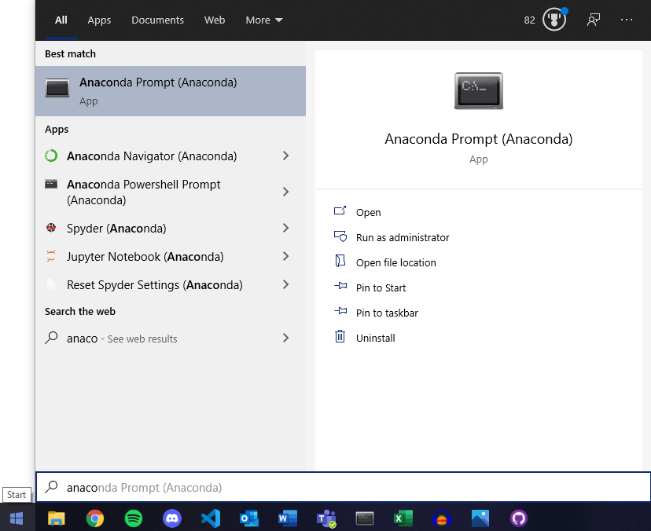
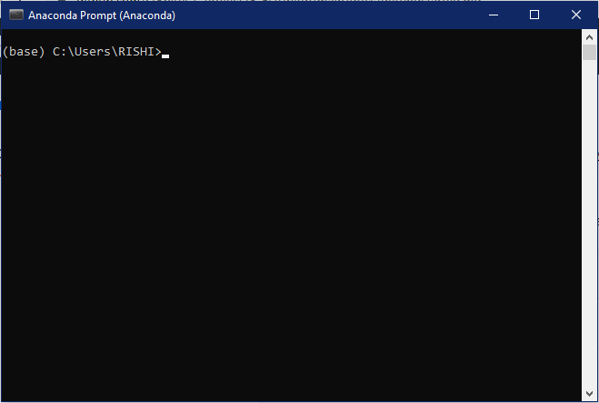

[__Back to home__](index.md)

# Getting Started

## Anaconda

Firstly install Anaconda by following the guide [here](https://docs.anaconda.com/anaconda/install/)

### Creating an Anaconda virtual environment

It is necessary to create a virtual environment when running a project in order to keep all your dependencies (in our case python library versions) isolated from other versions of the packages you may have.

Launch the Anaconda Prompt once you have Anaconda installed.
<p float="left">
  
  
</p>

In the Anaconda prompt terminal, execute the following command to create a virtual environment, depending on which models you want to run. You only need to do this process once!
#### For Yolov4 or Faster-RCNN model
```
conda create -n TF1env python=3.7
```
and follow the instructions, you will be prompted to enter 'y' in order to proceed with the creation. Next you will need to activate your virtual environment, to do this simply enter
```
conda activate TF1env
```
and you will see (base) change to (TF1env). 

You are now in the virtual environment in which to [install the necessary python libraries for Yolov4 or Faster-RCNN](#Python-Dependency-installation-for-Yolov4-or-Faster-RCNN).
#### For Custom Vision model
```
conda create -n TF2env python=3.7
```
and follow the instructions, you will be prompted to enter 'y' in order to proceed with the creation. Next you will need to activate your virtual environment, to do this simply enter
```
conda activate TF2env
```
and you will see (base) change to (TF2env). 

You are now in the virtual environment in which to [install the necessary python libraries for Custom Vision](#Python-Dependency-installation-for-Yolov4-or-Faster-RCNN).


### Python Dependency installation for Yolov4 or Faster-RCNN

We now need to install all the packages needed to make sure the system works as intended, this means installing the correct versions of packages used when developing the system. Luckily, this is a very simple process of commands. Please ensure you are in your virtual environment by checking for (TF1env), if you see (base) then please refer to the last code block of ["For Yolov4 or Faster-RCNN model"](#For-Yolov4-or-Faster-RCNN-model) to activate the environment.

To install the packages needed, run the following commands:
```
pip install pydub
pip install tensorflow-gpu==1.13.1 (if you are NOT running on gpu then pip install tensorflow==1.13.1)
pip install keras==2.0.8
pip install librosa
pip install pandas 
pip install matplotlib
pip install Pillow
pip install opencv-python
pip install ffmpeg
pip install ffprobe
pip install h5py==2.9.0
```
### Python Dependency installation for Custom Vision

We now need to install all the packages needed to make sure the system works as intended, this means installing the correct versions of packages used when developing the system. Luckily, this is a very simple process of commands. Please ensure you are in your virtual environment by checking for (TF2env), if you see (base) then please refer to the last code block of ["For Custom Vision model"](#For-Custom-Vision-model) to activate the environment.

To install the packages needed, run the following commands:
```
pip install pydub
pip install tensorflow
pip install librosa
pip install pandas 
pip install matplotlib
pip install Pillow
pip install opencv-python
pip install ffmpeg
pip install ffprobe
```
## CUDA, cudnnn installation for Yolov4 and Faster-RCNN (Ignore if not using GPU)
- Links to installations
