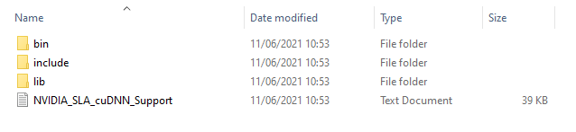
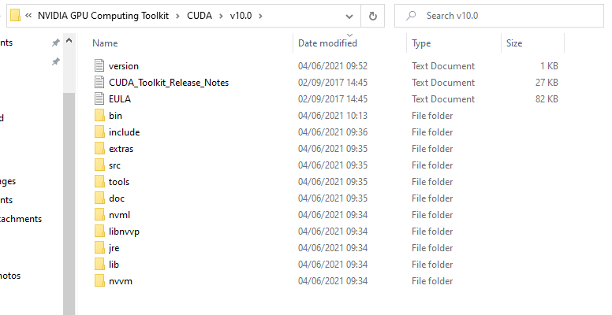
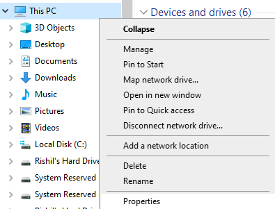
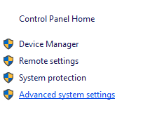
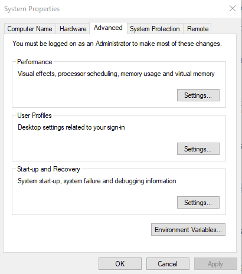

[__Back to home__](index.md)

# Getting Started

## Anaconda

Firstly install Anaconda by following the guide [here](https://docs.anaconda.com/anaconda/install/)

### Creating an Anaconda virtual environment

It is necessary to create a virtual environment when running a project in order to keep all your dependencies (in our case python library versions) isolated from other versions of the packages you may have.

Launch the Anaconda Prompt once you have Anaconda installed.
<p float="left">
  
  
</p>

In the Anaconda prompt terminal, execute the following command to create a virtual environment, depending on which models you want to run. You only need to do this process once!
#### For Yolov4 or Faster-RCNN model
```
conda create -n TF1env python=3.7
```
and follow the instructions, you will be prompted to enter 'y' in order to proceed with the creation. Next you will need to activate your virtual environment, to do this simply enter
```
conda activate TF1env
```
and you will see (base) change to (TF1env). 

You are now in the virtual environment in which to [install the necessary python libraries for Yolov4 or Faster-RCNN](#Python-Dependency-installation-for-Yolov4-or-Faster-RCNN).
#### For Custom Vision model
```
conda create -n TF2env python=3.7
```
and follow the instructions, you will be prompted to enter 'y' in order to proceed with the creation. Next you will need to activate your virtual environment, to do this simply enter
```
conda activate TF2env
```
and you will see (base) change to (TF2env). 

You are now in the virtual environment in which to [install the necessary python libraries for Custom Vision](#Python-Dependency-installation-for-Yolov4-or-Faster-RCNN).


### Python Dependency installation for Yolov4 or Faster-RCNN

We now need to install all the packages needed to make sure the system works as intended, this means installing the correct versions of packages used when developing the system. Luckily, this is a very simple process of commands. Please ensure you are in your virtual environment by checking for (TF1env), if you see (base) then please refer to the last code block of ["For Yolov4 or Faster-RCNN model"](#For-Yolov4-or-Faster-RCNN-model) to activate the environment.

To install the packages needed, run the following commands:
```
pip install pydub
pip install tensorflow-gpu==1.13.1 (if you are NOT running on gpu then pip install tensorflow==1.13.1)
pip install keras==2.0.8
pip install librosa
pip install pandas 
pip install matplotlib
pip install Pillow
pip install opencv-python
pip install ffmpeg
pip install ffprobe
pip install h5py==2.9.0
```
### Python Dependency installation for Custom Vision

We now need to install all the packages needed to make sure the system works as intended, this means installing the correct versions of packages used when developing the system. Luckily, this is a very simple process of commands. Please ensure you are in your virtual environment by checking for (TF2env), if you see (base) then please refer to the last code block of ["For Custom Vision model"](#For-Custom-Vision-model) to activate the environment.

To install the packages needed, run the following commands:
```
pip install pydub
pip install tensorflow
pip install librosa
pip install pandas 
pip install matplotlib
pip install Pillow
pip install opencv-python
pip install ffmpeg
pip install ffprobe
```
## CUDA, cuDNN installation for Yolov4 and Faster-RCNN (Ignore if not using GPU)
To run these models on GPU, you need to have exact versions of CUDA and cudnn installed. This allows for machine learning inference to take place on your GPU, rather than CPU. Running this inference on GPU typically speeds up the inference time by around 10 times that of a similar year released CPU (GPU dependent).

### Version downloads
The versions needed are:
* [CUDA 10.0](https://developer.nvidia.com/cuda-10.0-download-archive)
* [cuDNN 7.4](https://developer.nvidia.com/compute/machine-learning/cudnn/secure/v7.4.2/prod/10.0_20181213/cudnn-10.0-windows10-x64-v7.4.2.24.zip) (Account creation required)

The reason for this is because Tensorflow 1.13.1 requires certain versions of CUDA and cuDNN to run, see compatability table [here](https://www.tensorflow.org/install/source#gpu).

### CUDA 10.0
The installation for CUDA can be done by following the .exe installer instructions.

### cuDNN 7.4
This process is a short process that must be done manually. After downloading the cuDNN files from ["Version downloads"](#Version-downloads), unzip the folder and you will have a folder that looks like this:



These folders correspond to the folders where you have installed CUDA. In your C:\ drive (or wherever you installed CUDA), find the location where CUDA 10.0 has been downloaded, for example mine is:
> C:\Program Files\NVIDIA GPU Computing Toolkit\CUDA\v10.0


 
Inside this folder you will find folders of the same name of the folders in your cuDNN download. Simply copy the contents of the folders into each of the corresponding folders. If there is a folder within a folder, do not copy the whole folder in, follow the folders up until the files and then copy those into the corresponding locations.

### System Path check

A required check to ensure that CUDA will work properly is to check whether it has been added to the system path variables. To do this open windows file explorer and enter the properties of your PC and click "Advanced System Settings":

<p float="left">
  
  
</p>

This will open a panel that looks like the image on the left below. Click on "Environment Variables" and it will open a new window with a section called "System variables". It should include all the variables beginning "CUDA" like the image on the right below.

<p float="left">
  
  
</p>

If there are any missing, you can add them using the "New..." button. One thing to look out for, if the "CUDA_PATH_V10_0" is just "CUDA_PATH", this is also fine, just ensure the "Value" leads to the correct folder in your C:\ drive (or whenever you installed CUDA).

Below is a list of the variables and values for ease of use, if needed.

```
CUDA_BIN_PATH %CUDA_PATH%\bin
CUDA_LIB_PATH %CUDA_PATH%\lib\x64
CUDA_PATH_V10_0 C:\Program Files\NVIDIA GPU Computing Toolkit\CUDA\v10.0 (or wherever you installed CUDA)
CUDA_SDK_BIN_PATH %CUDA_SDK_PATH%\bin\win64
CUDA_SDK_LIB_PATH %CUDA_SDK_PATH%\common\lib\x64
CUDA_SDK_PATH C:\ProgramData\NVIDIA Corporation\CUDA Samples\v10.0 (or wherever your ProgramData for the samples)
```

