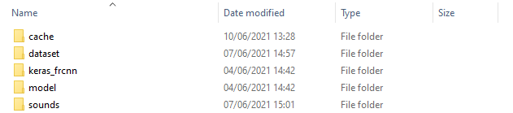
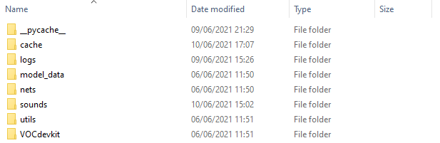
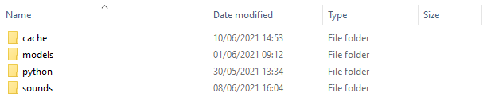
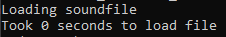
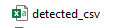

[__Back to home__](index.md)

# How to run

Once you have completed the [Getting Started](gettingstarted.md) step, you are now ready to run the detector on sound clips! Also, please download your desired model from [Code and Resources used](coderesources.md)

## Choosing the clips for detection

In the model files, there should be a folder called 'sounds', if not then simply create one in the main directory. The reason it may not be there is because sometimes sites like Github remove empty folders from projects. 

This 'sounds' folder is there to put the clips in that you want to detect!

The way the detector is designed is you can put multiple clips (at least 12s each) into the 'sounds' folder, then run the detector which would then detect the gunshots within each of those clips and generate a csv file of the results.

Putting in a 24 hour clip will scan through the whole 24 hours, it would work the same with a 1 hour, 2 hour or 10 minute clip.

IMPORTANT: the detector works in 12 second chunks, so the clips have to be minimum 12 seconds long, and preferably multiples of 12 seconds, but when it comes to longer clips it doesn't necessarily need to be a multiple of 12 seconds (i.e may be too hard, or you dont mind if the last x seconds (less than 12) will be cut off.

### For Faster-RCNN 

You should have the folders below:



If you downloaded the detector from GitHub, rather than drive, download [this file](https://drive.google.com/drive/folders/1AswdCXlv3cxjgTwge2dIbkBxJv8ztLMF?usp=sharing) and place it in the 'dataset' folder. If you having problems with this, just directly download the model from drive [here.](https://drive.google.com/drive/folders/14zVEjr4lzfFRlvO-5OPjV9ZKryxzValS?usp=sharing)

### For Yolov4

You should have the folders below:



### For Custom Vision

You should have the folders below:



## Running the detector

When running the detector, you need to make sure you are in the correct environment on your Anaconda Prompt, which can be seen in the brackets, i.e if running Yolov4 or Faster-RCNN you need to be in (TF1env), and for Custom Vision (TF2env). If not then simply activate the environment using 'conda activate TF1env' or 'conda activate TF2env'.

Please refer to ["Creating an anaconda environment"](gettingstarted.md#Creating-an-Anaconda-virtual-environment) if you are unaware of what this means. 

Once you are in your environment you must navigate to the location at which the detector code is. To do this in the Anaconda Prompt run the following:
```
cd C:\Path\To\Detector\File
```
where you change the "C:\Path\To\Detector\File" to the path of the detector.

Now we are ready to run the detector:

> There may be warning messages, it is OK to ignore them! They are mainly to do with version control and future usage of some of the python libraries.

### For Faster-RCNN 

If you would like to change the threshold, simply go into the detect.py file and change the variable 'bbox_threshold = 0.90' to 'bbox_threshold = x.xx', the value must be between 0 and 1.

```
python detect.py
```
### For Yolov4
```
python detect.py
```
### For Custom Vision
```
python python/predict.py sounds
```

You will find for all three detectors, it will say



which means it is sucessfully reading the soundfiles you provided! The time taken to load sound files vary, depending on CPU speed, load and size of the clip.

## Outputted results

All three detectors produce output spectrogram images along with a CSV files of the results. **The CSV file for all models is generated and saved in the main folder**, the image output locations vary.

### Tagged images

#### For Faster-RCNN 
> dataset\detected

#### For Yolov4
> VOCdevkit\VOC2007\detected

#### For Custom Vision
> cache\images

## Confirming proper operation

If the detector is working correctly, once it has finished running, all detected gunshots will be outputted in the corresponding folder. It should also generate a CSV file with a log of all the gunshots.



Also, during operation if you see text like in the image below, this confirms the sound files are being read with no issues.


